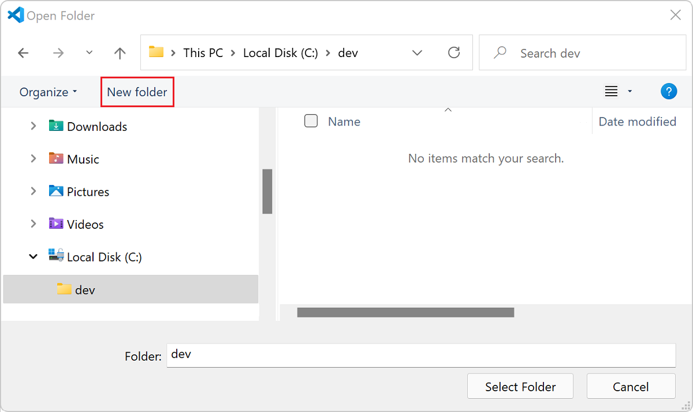
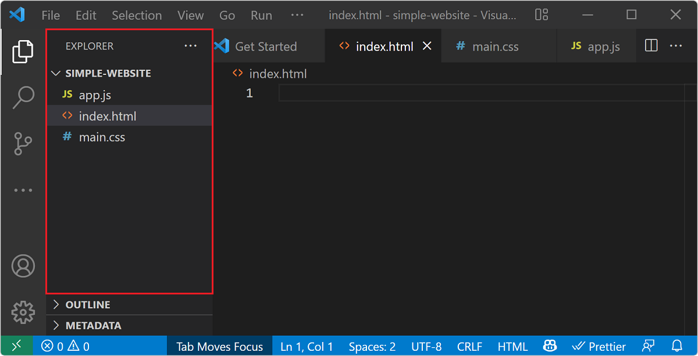
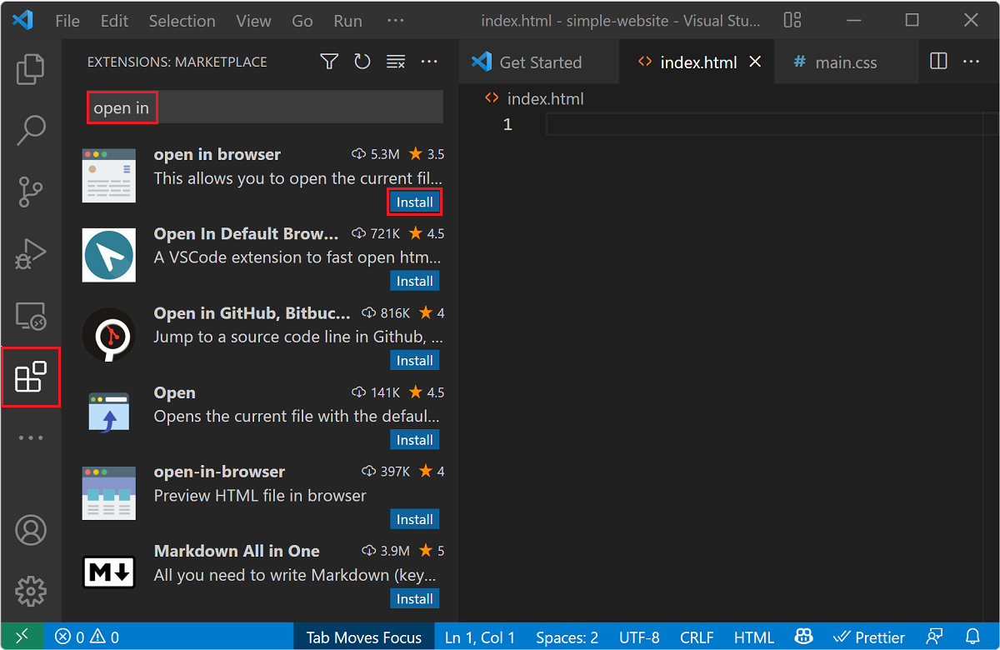
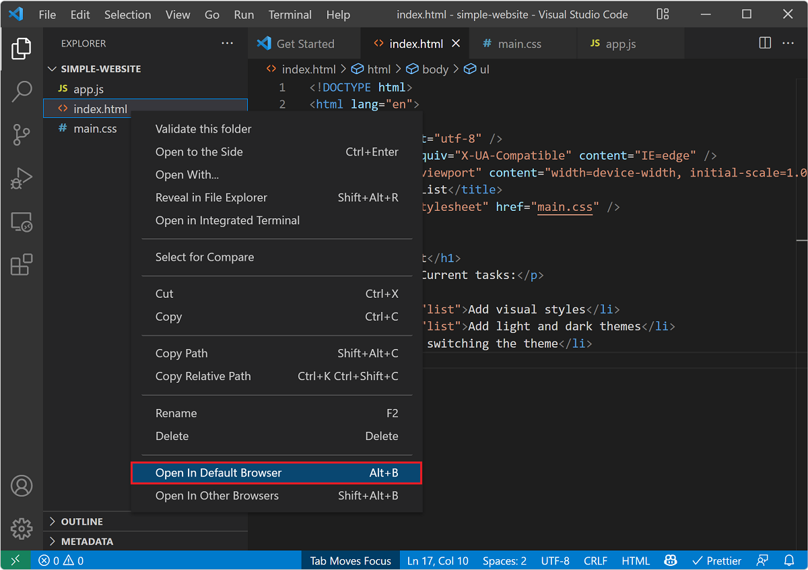
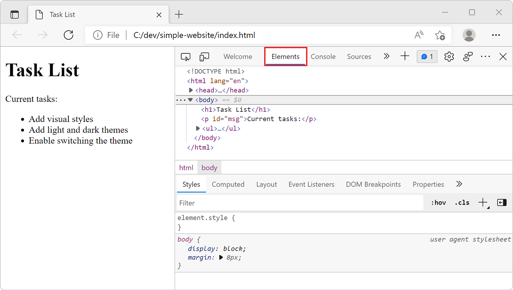

# Web Development for Beginners - A Curriculum
[](位置)
[](位置)
[](位置)
[](位置)
[](位置)
[](位置)
[](位置)

➤  **資料來源：**[**xxxx**](https://zh.wikipedia.org/zh-tw/HTML5) 

## 📣 What is HTML5?

**HTML5 is the fifth revised version of HTML. The standard was completed by W3C in October 2014.**

**Broadly speaking, HTML5 refers to a set of technology combinations that include HTML, CSS and JavaScript. These three technologies have also been innovated, with the purpose of reducing the need for plug-ins in web browsers, such as: Adobe Flash, Microsoft Silverlight, and Oracle JavaFX. And provide more standards sets that can effectively enhance network applications.**

**Among them, HTML5 has added new projects that in the past could only be completed with Flash.For example, functions such as video, audio, drawing, and animation...Adobe Flash will cease to be fully updated in 2020, and the affected mainstream browsers will stop supporting Adobe Flash!**

➤  **資料來源：** [**維基百科**](https://zh.wikipedia.org/zh-tw/HTML5)   

**HTML5 not only adds new audio and video functions, but also adds many more meaningful grammatical features and elements, using grammatical tags to make the structure simpler! In the past, websites would be full of `<div>` and `<table>` wrapping content, but now you only need to use `<section>`, `<article>`, `<header>`, `<footer>`, `<aside>` and `<nav>`, so that The source code of the web page is more simplified and structured, so that crawlers can better understand the content of the website, thus improving search engine rankings!**

➤  **資料來源：**[**W3School 標籤列表**](https://www.w3schools.com/tags/default.asp) 


## 📋 Setting up your environment

### Create a new folder for your website

#### 1. Open Visual Studio Code。

&nbsp;&nbsp; **When you start Visual Studio Code, the Welcome page opens.**  
&nbsp;&nbsp; **Note that you can create new files or open folders in the Start list.**

&nbsp; 

#### 2. Open Folder

- [ ] **Select Open Folder from the Start list in Welcome,**  
- [ ] **Select File > Open Folder from the Visual Studio Code menu.**

&nbsp; 

#### 3. Create Some Files

&nbsp; 

#### 4. Install Extension Modules or Kits

&nbsp; 

#### 5. Open in Browser

&nbsp; 

#### 6. View the Page Using Developer Tools

&nbsp; 

➤  **資料來源：**[**使用 Visual Studio Code 開始進行網頁程式開發**](https://learn.microsoft.com/zh-tw/training/modules/get-started-with-web-development/) 

## 🌱 Quickstart - HTML Tag Structure

A minimal HTML Tag Structure looks something like this：  
You can open it in the Example.html file in the 1 - Structure folder.

```html
<!Doctype HTML>
<html>
	<head>
		<title>
			My Website
		</title>
	</head>
	<body>
		Hello, World!	
	</body>
</html>
```


```bash
                    ╭┈┈┈┈┈┈┈┈┈┈┈╮
                    ┆  Element  ┆
                    ╰┈┈┈┈┈┬┈┈┈┈┈╯
                          ▼ 
     ╭┈┈┈┈┈┈┈┈┈┈┈┈┈┈┈┈┈┈┈┈┴┈┈┈┈┈┈┈┈┈┈┈┈┈┈┈┈┈┈┈┈┈╮
  開始標籤              文本内容               結束標籤
     ▼               ╰┈┈┈┈┬┈┈┈┈╯               ▼
╭┈┈┈┈┴┈┈┈┈┈┈┈┈┈┈┈┈┈┈┈┈┈┈┈┈┴┈┈┈┈┈┈┈┈┈┈┈┈┈┈┈┈┈┈┈┈┴┈┈┈┈╮
┆ <div class="ab">   this my content        </div>  ┆
╰┈┈┈┈┈┈╱┈┈┈┈┈┈┈┈╲┈┈┈┈┈┈┈┈┈┈┈┈┈┈┈┈┈┈┈┈┈┈┈┈┈┈┈┈┈╲┈┈┈┈┈╯
   属性名稱      属性值                    注意结束"/"符號
    name        value
     ╰┈┈┈┈┈┈┬┈┈┈┈┈╯
     Attribute(属性)
```


### Semantic｜語法更有意義

### Offline Storage｜離線存取

### Device Access｜設備兼容性

### Connectivity｜連線、即時通訊

### Multimedia｜網頁多媒體
### 3D/ Effects/ Graphics｜3D圖形及特效
### Integration/ Performance｜效能與整合
