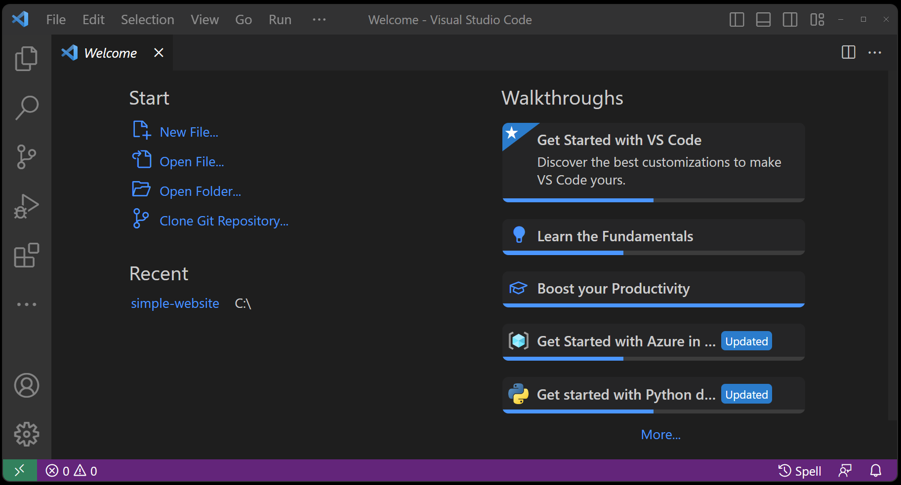

# Web Development for Beginners - A Curriculum
[](位置)
[](位置)
[](位置)
[](位置)
[](位置)
[](位置)
[](位置)

➤  **資料來源：**[**xxxx**](https://zh.wikipedia.org/zh-tw/HTML5) 

## 📣 什麼是HTML5？

HTML5 is the fifth revised version of HTML. The standard was completed by W3C in October 2014.

Broadly speaking, HTML5 refers to a set of technology combinations that include HTML, CSS and JavaScript. These three technologies have also been innovated, with the purpose of reducing the need for plug-ins in web browsers, such as: Adobe Flash, Microsoft Silverlight and Oracle JavaFX requirements, and provide a more set of standards that can effectively enhance network applications.

廣義上來說，HTML5是指包含了HTML、CSS和JavaScript的一套技術組合，這三種技術也都有了創新，目的在於希望能夠減少網頁瀏覽器對於外掛程式的需要，例如：Adobe Flash、Microsoft Silverlight與Oracle JavaFX的需求，並且提供更多能有效加強網路應用的標準集。

➤  **資料來源：** [**維基百科**](https://zh.wikipedia.org/zh-tw/HTML5)   

  
HTML5不僅新增了影音及視訊…等功能，還新增了很多更有意義的語法特徵和元素，利用語法標籤讓結構變得更加簡單！在以往的網站都會有滿滿的＜div＞和＜table＞包覆內容，而現在只需要利用＜section＞、＜article＞、＜header＞、＜footer＞、＜aside＞和＜nav＞，讓網頁原始碼更加簡化、結構化，這樣爬蟲就能更加理解網站內容，因此提高搜尋引擎的排名！

➤  **資料來源：**[**W3School 標籤列表**](https://www.w3schools.com/tags/default.asp) 


## 📋 Setting up your environment

### 為您的網站建立新資料夾

1. 打開 Visual Studio Code。

	當您開啟 Visual Studio Code 時，〔歡迎〕頁面會隨即開啟。  
 	請注意，您可以在 〔開始〕清單中建立新檔案或開啟資料夾。



➤  **資料來源：**[**使用 Visual Studio Code 開始進行網頁程式開發**](https://learn.microsoft.com/zh-tw/training/modules/get-started-with-web-development/) 

## 🌱 Quickstart - HTML Tag Structure

A minimal HTML Tag Structure looks something like this：  
You can open it in the Example.html file in the 1 - Structure folder.

```html
<!Doctype HTML>
<html>
	<head>
		<title>
			My Website
		</title>
	</head>
	<body>
		Hello, World!	
	</body>
</html>
```


```bash
                    ╭┈┈┈┈┈┈┈┈┈┈┈╮
                    ┆  Element  ┆
                    ╰┈┈┈┈┈┬┈┈┈┈┈╯
                          ▼ 
     ╭┈┈┈┈┈┈┈┈┈┈┈┈┈┈┈┈┈┈┈┈┴┈┈┈┈┈┈┈┈┈┈┈┈┈┈┈┈┈┈┈┈┈╮
  開始標籤              文本内容               結束標籤
     ▼               ╰┈┈┈┈┬┈┈┈┈╯               ▼
╭┈┈┈┈┴┈┈┈┈┈┈┈┈┈┈┈┈┈┈┈┈┈┈┈┈┴┈┈┈┈┈┈┈┈┈┈┈┈┈┈┈┈┈┈┈┈┴┈┈┈┈╮
┆ <div class="ab">   this my content        </div>  ┆
╰┈┈┈┈┈┈╱┈┈┈┈┈┈┈┈╲┈┈┈┈┈┈┈┈┈┈┈┈┈┈┈┈┈┈┈┈┈┈┈┈┈┈┈┈┈╲┈┈┈┈┈╯
   属性名稱      属性值                    注意结束"/"符號
    name        value
     ╰┈┈┈┈┈┈┬┈┈┈┈┈╯
     Attribute(属性)
```


### Semantic｜語法更有意義

### Offline Storage｜離線存取

### Device Access｜設備兼容性

### Connectivity｜連線、即時通訊

### Multimedia｜網頁多媒體
### 3D/ Effects/ Graphics｜3D圖形及特效
### Integration/ Performance｜效能與整合
